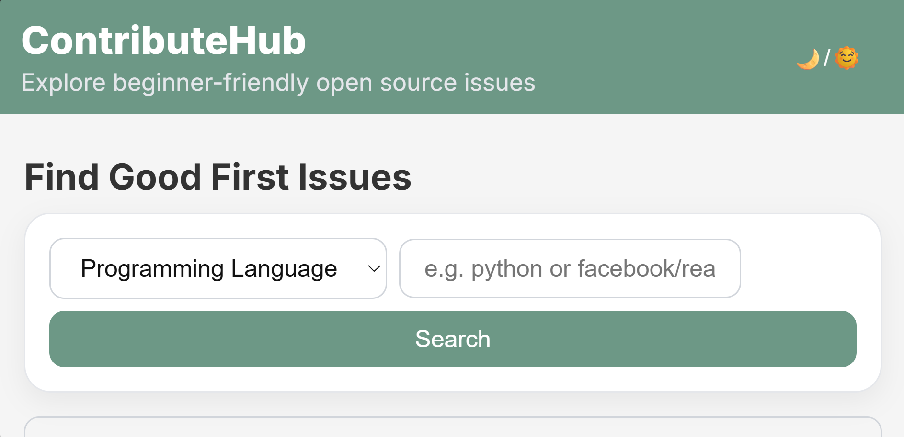
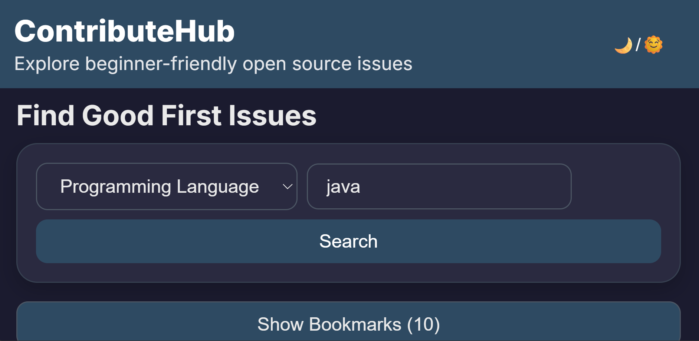
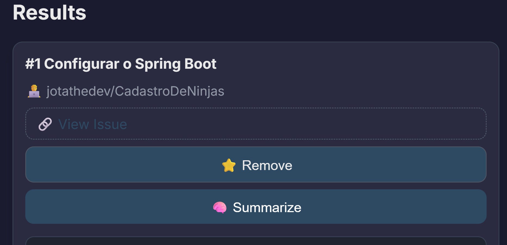
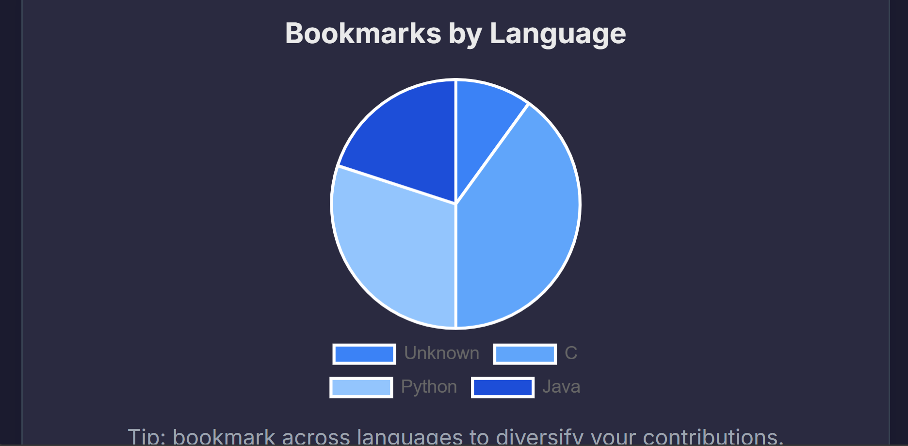

# 🚀 ContributeHub

Discover, bookmark, and summarize beginner-friendly GitHub issues — with AI-powered summaries, a bookmarks pie chart, and a clean light/dark theme.

---

## ✨ Features

- 🔍 **Search GitHub Issues** by programming language or repository name
- 🧠 **AI Summarization** (OpenAI API support, with offline fallback)
- ⭐ **Bookmark** your favorite issues (saved in `localStorage`)
- 📊 **Pie Chart** of bookmarks by language (Chart.js)
- 🌙 **Dark/Light Mode** toggle with theme colors
- 📱 **Responsive Design** for all devices
- ⚡ **Fast and beginner-friendly interface**

---

## 📦 Live Demo

Check out the live version of the project here:  
👉 [ContributeHub+ Live Demo]( https://eshika30.github.io/contributehub/)  


---

## 🛠️ Built With

- HTML, CSS, JavaScript
- GitHub REST API
- Chart.js
- OpenAI API *(optional for advanced summaries)*

---

## 👤 Author

**Eshika Raut**  
📧 your-email@example.com  
🔗 [LinkedIn](www.linkedin.com/in/eshika-raut-96605a22a)  
🔗 [GitHub](https://github.com/eshika30)

---

## 📄 License

MIT License

---

# 🚀 ContributeHub+: Find, Bookmark & Summarize GitHub Issues

ContributeHub+ is a modern open-source issue explorer designed to help beginner contributors quickly find good first issues, bookmark them, and understand them using AI summaries — all in a simple, responsive UI with light/dark themes.

) <!-- Replace with your screenshot path -->
 <!-- Replace with your screenshot path -->

---

## ✨ Features

- 🔍 **Search Issues** by language or repository
- 🎯 **Sort & View** latest good-first-issues
- 🧠 **Summarize** issues using AI (OpenAI) or offline
- ⭐ **Bookmark** and manage saved issues
- 📈 **Pie Chart** view of bookmarks by language
- 🌙 **Dark/Light Mode** toggle
- 📱 **Responsive** for mobile, tablet, and desktop

---

## 📸 Screenshots

| Search View | Bookmarks & Chart | AI Summarizer |
|-------------|-------------------|---------------|
|  |  |  |


---

## 💡 How It Works

- Uses the [GitHub REST API](https://docs.github.com/en/rest) to fetch open issues labeled **good first issue**.
- Allows bookmarking of issues locally (stored in `localStorage`).
- Displays a **pie chart** of bookmarked issues by language using Chart.js.
- Uses **OpenAI API** (optional) for natural language summaries of issues.

---

## 🛠️ Tech Stack

- **HTML**, **CSS**, **JavaScript**
- **Chart.js**
- **GitHub REST API**
- **OpenAI API** *(optional)*

---

## 📁 Folder Structure

```bash
contributehub-plus/
│
├── index.html          # Main HTML
├── style.css           # Styling
├── script.js           # Main functionality
├── README.md           # Project info
└── /screenshots/       # (Optional) Screenshots
